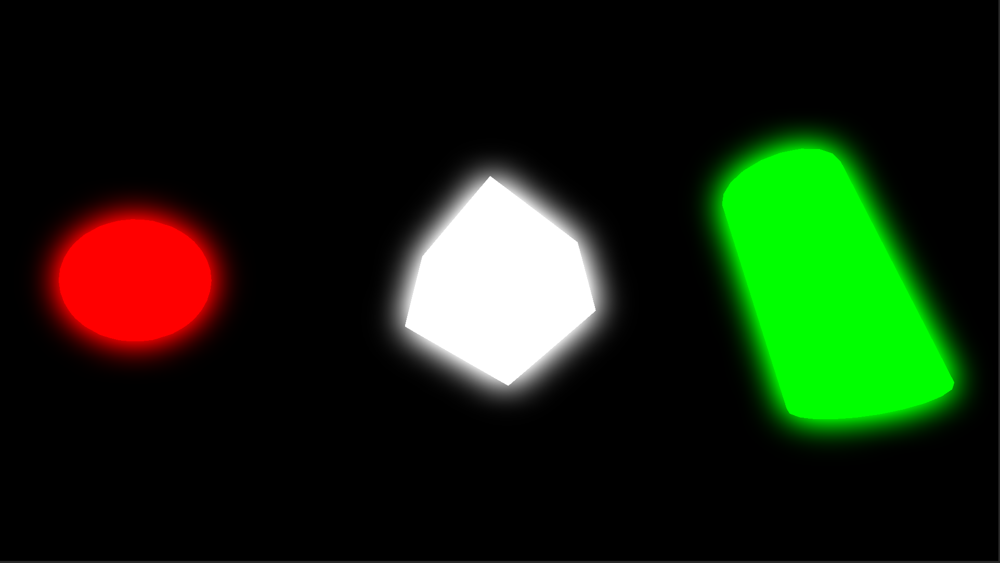

Bloom
===

画面内から一定以上の輝度の高さの部分を抜き出し、その部分にBlurをかけてぼかしつつ加算して明るくしていく。  
ぼかして明るくした画像を画面に対して合成することによって、Bloom Effectをかけることができる。  

輝度を抽出する閾値を定数で扱うと、Bloomのかかる部分が急激に変化してしまう。  
なのでSoft Kneeによって滑らかに変化させていき、微調整を効かせやすくする。

 

